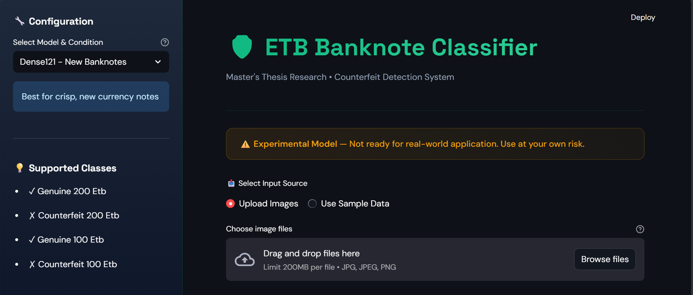
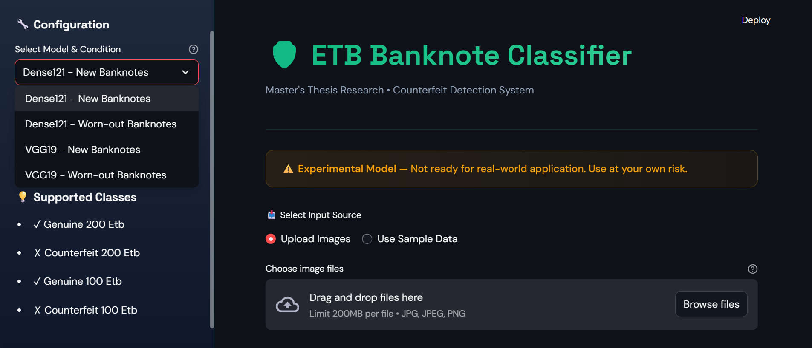
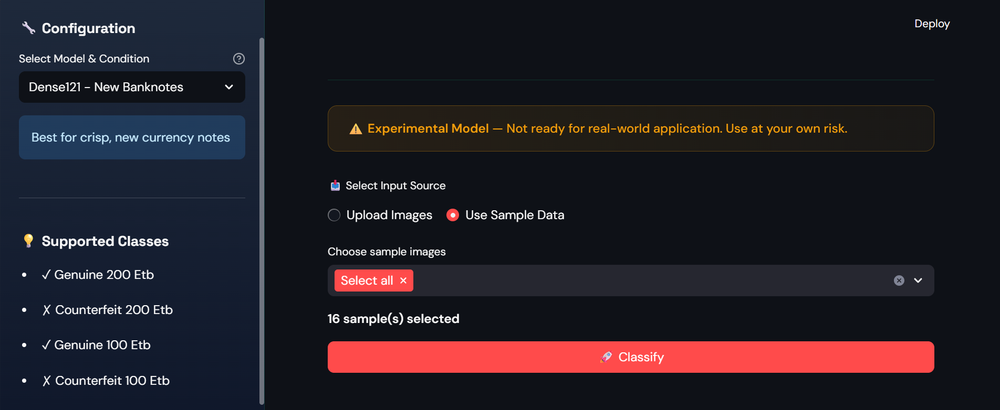
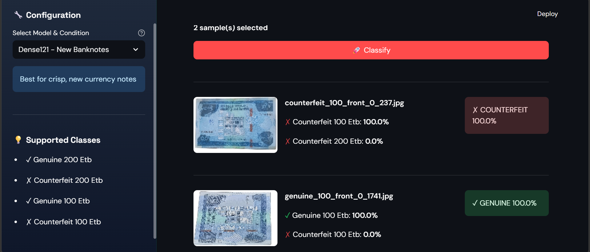
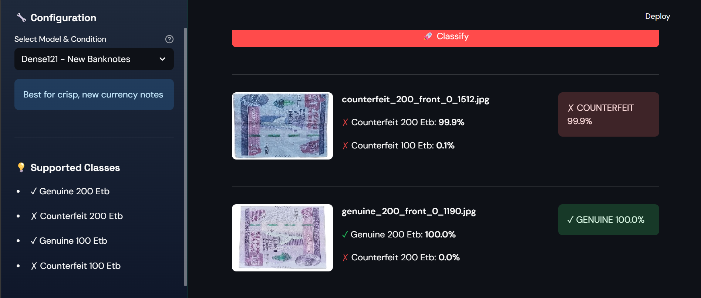

# Counterfeit Ethiopian Banknote Classification

A master's thesis research project for detecting counterfeit Ethiopian banknotes (100 and 200 ETB) using deep learning and TensorFlow Lite models.

## Overview

This project implements a machine learning-based classification system to identify counterfeit Ethiopian currency, specifically focusing on the 100 and 200 ETB banknotes. The research aims to contribute to financial security by providing an automated detection mechanism.

## Features

- **Multiple Model Support**: Choose from various pre-trained CNN architectures
- **Real-time Classification**: Upload banknote images and get instant detection results
- **User-friendly Interface**: Built with Streamlit for easy interaction
- **TensorFlow Lite Integration**: Lightweight models for efficient inference

## Models

The project includes multiple pre-trained TensorFlow Lite models:

| Model                                    | Description                    |
| ---------------------------------------- | ------------------------------ |
| `Dense121_best_weights_mixed-III.tflite` | Best performing Dense121 model |
| `dense121.tflite`                        | DenseNet121 architecture       |
| `Vgg16.tflite`                           | VGG16 architecture             |
| `Vgg19.tflite`                           | VGG19 architecture             |
| `Vgg19_mixed.tflite`                     | Mixed VGG19 variant            |

## Project Results

Below are screenshots demonstrating the successful execution of the application:

### 1. Main Application Interface


The Streamlit web application interface showing the home page with navigation options.

### 2. Model Selection and Image Upload


Users can select their preferred TensorFlow Lite model and upload banknote images for classification.

### 3. Classification Results Display


The classification results showing the predicted class (Genuine or Counterfeit) with confidence scores.

### 4. Detailed Prediction Analysis


Detailed view of the prediction probabilities for each class.

### 5. Model Performance Metrics


Confusion matrix and accuracy metrics showing the model's classification performance.

## Requirements

See `requirements.txt` for Python dependencies.

## Installation

1. Clone the repository
2. Install dependencies:

```bash
pip install -r requirements.txt
```

## Usage

```bash
python counterfeit_etb_classification.py
```

Or run with Streamlit:

```bash
streamlit run counterfeit_etb_classification.py
```

## Research Context

This project was developed as part of a master's thesis research focusing on computer vision techniques for currency authentication in the Ethiopian financial system.
